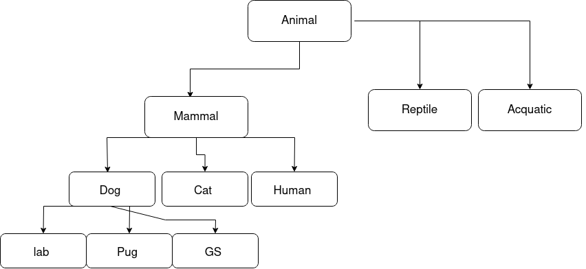
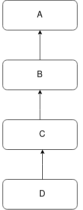
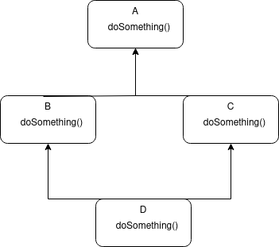

# Low Level Design

Low level design deals with details of the software required to implement various components of a web/system application. These software details include classes, attributes and methods in these classes, communication between classes etc.

The activities in a typical working day of a software engineer are the following

1. Meetings/Scrum - Requirements gathering, planning
2. Code Review - Readability is important here to effectively review code.
3. Solve Bugs/Debug - Code should be readable to identify bugs that come up during compile or runtime.
4. Documentation - For future readability. 
5. Testing - Ensure no/fewer bugs in the future.

## How does LLD help here? 

LLD helps you make all the tasks above easier. It helps to make the code readable/understandable. It helps you in requirements gathering. It also helps in making you system extensible and maintainable. 

Extensible: Easy to add new feature. It should not take a lot of time to incrementally add a new feature.

Maintainable: Easy to keep the current system in working condition. Why might a current system break or stop working? Bugs might show up in the system. Updates in OS or third party libraries being used. A maintainable system should make it easy to make the changes in order to keep the system running.

## Introduction to LLD

There are some common paradigms in programming.

1. Procedural programming - This is used by beginners
2. Object-oriented programming - The topic of our discussion
3. Functional programming
4. Reactive programming
5. Declarative programming (SQL)

## Procedural Programming

Procedure is a set of instructions to perform a task or achieve an outcome. This is the same definition as a function. A procedure is nothing but a function/method. We organize our code into a bunch of procedures. Each procedure may internally call other procedures. Execution of a program starts from a special procedure (called main()).

Procedure can be formally defined as a set of instructions that work on a given set of data and may output some data. 

### Cons of Procedural Programing

The basic structure of an english sentence is subject + verb. Subject perform action. Suppose, we want to print details of student. Using the procedural paradigm we might call a function like this
```
print(string name, int age, string gender){
    system.out(name);
    system.out(age);
    system.out(gender);
}
```
In the procedural paradigm, there is a way to combine a set of attributes using something called struct/structure. To create a struct
```
struct Student{
    String name;
    int age;
    String gender;
}
```
A struct has no methods. All the variables in a struct are visible to anyone else. They are not private.

Now we can rewrite the print function as
```
printStudent(Student student){
    system.out(student.name);
    system.out(student.age);
    system.out(student.gender);
}
```
In this case the subject can be considered to be the student and the action can be considered to be printStudent. In procedural paradigm, we see that something is happening to someone. Action is being performed on entity. In real life, entity performs action. In this case it is difference between printStudent(student) vs. student.print(). In the first case, the printStudent method is performing an action on student, whereas in the second, the student is performing the action print.

In procedural programming, everything about an entity is public. What is the problem with this? In the procedural world, there is a controller who makes entities perform actions. The controller has access to all information of entities. So controller can play around in any way with entity's attributes. If by any chance a controller changes the values of some of the entity's attributes, it would be difficult to debug.

Object-oriented programming says that a software system should consist of entities. Each entity controls its attributes and also has a defined behaviour. What would the entity student look like here?
```
class Student{
    String name;
    int age;
    String gender;

    void print(){
        system.out(name);
    }
}
```
As you can see, student is in control of its behaviour. 

To summarize, the cons of procedural programming are:

1. It will be difficult to make sense of a complex system. This is because any action that can be taken on entity will be at difference locations. In contrast, every action that student will perform will be in the class itself.

2. Understandability is difficult.
3. Difficult to debug.
4. Spaghetti code. This means parts of the code relating to an entity are lying in different parts of the filesystem.


## Object Oriented Programming

Principle: Abstraction

Pillars: Inheritance, Encapsulation, Polymorphism

## What is Abstraction?

The quality of dealing with ideas and not events. It means representing an entity in terms of ideas. In the software world, anything that has attributes (information) or associated behaviour is an idea.

Taking the example of an education web app, we will need to represent students, instructors, classroom, batch, assignment, questions etc. Student has information and also associated behaviours. Student has information like name, university attended etc. Student also has behaviours like attending a class, sending messages, taking exam etc.

An idea can either be a real entity associated with a system or it can be a concept. When you represent something as an idea, others do not need to know the details of these ideas. Consider a car. When we think of a car as a driver, we think of steering wheel etc. Steering wheel has one behaviour that we care about as a driver. That it can turn.  We do not care about how this is achieved. 

Others do not need to know about the detail of implementation of ideas.

## Encapsulation

Encapsulation is a pillar that helps us achieve abstraction. Encapsulation allows us to store attributes and behaviours of an idea together in a single place. What is this place? It is a class.

There is another benefit to encapsulation. It helps us protect the attributes and behaviours from illegitimate access of other classes. 

## Terms of OOP

**Class** - Blueprint of an idea. Let's take the idea of a student that we saw earlier. Let's explore some of a student's attributes and ideas.

```
class Student{
    int age;
    String name;
    String batch;
    double psp;
    changeBatch();
    pauseCourse();
    giveMockInterview();
}
```

Class is not a real thing yet. It does not take any space in memory. It is a blueprint that we use to create multiple instances of this class. What are these instances called? Objects.

**Object** - Real instance of the class. Objects will occupy memory. Each object is different from each other. 

```
class Main {
    void main(){
        Student naman = new Student();
        naman.name = "Naman";
        naman.age = 25;
        naman.psp = 0.0;

        Student dinesh = new Student();
        dinesh.name = "Dinesh";
        dinesh.age = 20;
        dinesh.psp = 100.0;
    }
}
```
Two objects of class Student, naman and dinesh, have been instantiated. They occupy space in the memory and are distinct from each other.

**Access Modifiers** - We saw earlier that one of the benefits of encapsulation is that it protects the members from illegitimate access. How is this done? Using access modifiers. 

There are 4 access modifiers:

1. Public

If an attribute or a method has the access modifier public, then anyone outside the class can access thiis attribute or method.

2. Private

This is the exact opposite of access modifier public. It is only accessible within its own class. No one can access it, including the child class.

3. Protected

An attribute or method that has the access modifier protected can be accessed only from anything that is in the same package.

4. Default

```
            Class   |   Package     | Subclass/child | Subclass/child |   World
                                        (same pkg)        (diff pkg)

private       +     |      -        |       -        |        -       |     -

default       +     |      +        |       +        |        -       |     - 

protected     +     |      +        |       +        |        +       |     -

public        +     |      +        |       +        |        +       |     +

```


**Constructors** - To instantiate an object of a class we run the following
```
Student st = new Student();
```
Student is the datatype. st is the variable name. new Student() is the constructor. To be more specific, this is the default constructor. When we dont create our own constructor in the class, a default constructor is created. This creates a new object of the class and sets the value of each attribute as the default value of that type. 

The constructor code looks like this
```
Student(){
    name = null;
    age = 0;
    psp = 0.0;
    universityName = null;
}
```
This code is generated automatically in case the default constructor is called. 

The constructor looks similar to a method. Default constructor does not take any parameters. It sets every attribute of the class to the default value of the attribute's datatype unless we have already specified a default value. The constructor access modifier is public. The name of the constructor is the name of the class. There is no return type in the constructor. 

Suppose we write our own constructor
```
class Student{
    private int age;
    String name;
    String univName;
    double psp;
    boolean isPlaced;

    public Student(String studentName, String universityName) {
        name = studentName;
        univName = universityName;
    }
}
```
Let us now create a client class.
```
class Client {
    public static void main(String[] args){
        // Student st = new Student(); This will throw an error
        Student st = new Student(studentName: "Naman", universityName: "ABC");
    }
}
```
Let us run this and look at the values that the attributes of these objects take. When a custom constructor is called, all the values of the attributes are initialized to the default value of the corresponding datatype. Then it will start executing the code inside the constructor. The default constructor is not called or created. 

If we set the contructor's access modifier to private, then it is not possible to create an object of the class because neither can the constructor be called from outside the class, nor will a default constructor be created because of the presence of a parametrized constructor.

We can have multiple constructors in the class each parameterized by a different value.

Suppose we want to create a new object that takes the exact values as an older object.

```
class Student{
    private int age = 21;
    String name;
    String univName;
    double psp;
    boolean isPlaced;
    
    public Student(String studentName, String universityName) {
        name = studentName;
        univName = universityName;
    }

    public Student(Student old) {
        name = old.name;
        age = old.age;
        univName = old.univName;
        psp = old.psp;
        isPlaced = old.isPlaced;
    }
}
```
The client code will look like
```
class Client {
    public static void main(String[] args){
        Student st1 = new Student(studentName: "Naman", universityName: "LFG");
        st1.psp = 100.0;
        st1.isPlaced = false;

        Student st2 = new Student(st1);
    }
}
```
Instead of the above, if we run
```
Student st2 = st1;
```
st2 is not a new object as we did not call a constructor. st2 is just a variable pointing to st1.
So if we run
```
st2.name = "Aman"
```
then st1.name will also become Aman.

If we create st2 using the copy constructor, then st2 and st1 will occupy different memory address. 
So, if we run
```
st2.name = "Aman"
```
then st1.name will remain "Naman".

There are 2 types of data in Java.

1. Primitive Types - Integers, double, float etc. 

2. Objects - These are stored in memory. Variable stores the address of object. When we create
```
Student st = new Student();
```
it creates a new object in memory. st stores the address of the object. The name in st is also an object datatype as it is a string. So, java creates an object with value "Naman" in memory and the address to this object will be stored in st.name. In contract st.age will store the value itself in the memory occupied by the object.

In a copy constructor, we create a new object. st2 will be at a different memory location than st1. 


The above is a Java memory heap. We have two objects that are occupying addresses 1721 and 4741. The name attribute of each object is pointing to the string object at 2141. If we run
```
st2.name = "Hello"
```
Then an object with string "Hello" is created at 41. The name attribute of st2 now starts pointing to address 41. So, the name attribute of st1 will not change. 

Assume strings are mutable in Java, and assume we run the following code instead of the one above.
```
st2.name.add("123")
```
This will go to memory address 2141 and add "123" to "Kiran". This will not create a new object. Now, after making the change, the name attribute of st1 will also change from the previous "Kiran" to "Kiran123".

Even though we created a new object, behind the scenes, the new object still refers to a few attributes of the old object. This means the new and old object still share some data. This means both are not completely seperated. This means we performed a shallow copy. As opposed to shallow copy, deep copy means no attribute will have shared data. 

In Java, it is practically difficult to create a deep copy. Consider a student object that has a list of classes. Assume every class has a name and instructor. Lets look at the memory heap.


There are many pointers as all of the data in the memory are of the type object. Hence, to make a deep copy, we will have recursively make a copy of every object and create a new object. This practically very difficult.

```
doSomething(Student st) {
    st.name = "Naman";
}

st1 = new Student();
doSomething(st1);
```
When we run the above code, st1.name will become "Naman". As Java is pass by value, the value that is passed as argument is the address of the object that is stored in st1. So when wwe run st.name = "Naman", we go to the address and change the name attribute in the object. 

However, consider the following function.
```
doSomething(Student st) {
    st = new Student();
}
st1 = new Student();
doSomething(st1);
```
In this case, assigning a new object to st in the function doSomething does not change the object stored in st1. The variable st gets a new object without changing the value of st1. If Java supported pass-by-reference, then running the above code will change st1 to the same new object created and stored in st. This is because pass-by-reference is actually passing a reflection of the argument. Pass-by-value is passing the value of the argument to a new variable created in the parameter of the function.


**Destructor** - Once, work is done with an object, in languages like Java and Python, garbage collector removes these objects. In languages like C++, which are languages that use pointers, we have to use destructors to free up memory occupied by objects that are not in use anymore. 


## Inheritance

Object oriented programming is based on thinking about software systems in the same way as we think about the real world. We form hierarchy/relations betweeen different entities inorder to understand them. In the same way, object oriented programming also allows us to form hierachies of categorization.



Consider the above categorization. If animals can walk, then does that mean a lab can walk? Yes. Lab is a dog is a mammal is an animal that can walk.

This kind of hierarchy of representation allows us to share behaviours and attributes with specific categories.

Representation of hierarchy in classes is known as inheritance. This takes the form of parent/child relationship between different classes.

Consider the example of scaler platform. A user of the platform can have a hierarchy. 


If a user can login(), then all the user's children can also login. Each child of user will share all the members (attributes and methods) of user class. A child class can have its own attributes and methods as well. Parent class can also be called a super class and a child class can also be called a subclass.

Child classes inherit all the members of the parent classes and may or may not add their own members to them.

```
class User {
    String username;
    void login() {
        system.out("Logging in...");
    }
}

class Instructor extends User {
    String batchName;
    double avgRating;
    void scheduleClass(){
        system.out("Scheduling class...");
    }
}
```

Parent class is a generalization. Child class is a specification.


Which of these classes has the highest level of abstraction? 

The answer is class A. Abstraction means an idea. Highest level of abstraction means a relatively generalized idea. The least specific class amongst all the classes is class A. 

When an object of the child class is instantiated, it also contains the attributes of the parent class. How are the attributes of the parent class initialized?

There are 2 options.

1. We know how to initialize them. So we can define them in the child class constructor.
```
class User {
    String name;
    String email;
    String password;

    void login() {
        system.out("Logging in...");
    }
}

class Instructor extends User{
    String batch;
    
    public void Instructor() {
        name = "a";
        email = "email@email.com";
        password = "password";
    }
}
```
We might not always know how to initialize the attributes of the parent class. An example would be if the parent class is from a third party library.

2. The constructor of the parent definitely knows how to initialize its attributes. 



Suppose we run
```
D d = new D();
```
a. The constructor of D will be called.
b. Before the constructor of D executes, it will call the constructor of C.
c. Before the constructor of C executes, it will call the constructor of B. 
d. Before the constructor of B executes, it will call the constructor of A.

So the execution of the constructor of A completes first, then the one of B completes, then the one of C completes and then the one of D completes.

This example assumes we are calling default constructors. If we want to call a specific constructor we have to use super().
```
class A {
    A() {
        System.out.println("Constructor of A");
    }
}

class B {
    B() {
        System.out.println("Constructor of B");
    }
}

class C {
    C() {
        System.out.println("Constructor of C");
    }

    C(String c){
        System.out.println("Constructor of C with param");
    }
}

class D {
    D() {
        super(c:"Hello");
        System.out.println("Constructor of D");
    }
}
```
The first line of the constructor of D should be super(c:"Hello"). If it is the second line, it will throw an error.
super() -> super can be thought of as the name of the class. So super() is calling the constructor of the class. So, if we dont pass argument in super(), then it calls the default constructor.

## Polymorphism

If we go back to the Scaler example, the user takes multiple forms like student, instructor, mentor, TA etc. If we make a list of all users, then the list will take all objects of type User and of type any child class of User.

```
List<User> users = {
    new Student();
    new TA();
    new User();
    new Instructor;
}
```

Similarly, when creating a new object, we can run the following
```
User u = new Student();
```
However, we cannot do the following
```
Student st = new User();
```
This means we can put objects of child classes into a variable that takes the parent class datatype.

```
class A {
    int age;
    String name;
}

class B extends A {
    String univ;
}

class C extends A {
    String company;
}
```
Given the above, what happens when we run the following?
```
A a = new C();
a.company = "Google";
```
This will throw a compile time error. Compiler will allows access to members that are of that data type.

Polymorphism's use case is that it makes the code reusable. Consider the changePassword() function.
```
changePassword(User user, String newP) {
    user.password = newP;
}
```
Now, to this function we can pass objects of any of the child class of User. Polymorphism makes the code general. The more general your code, the better its reusablilty.

There are two types of polymorphism.
1. Compile Time poymorphism
2. Run Time polymorphism. 

Until now, we saw polymorphism in inheritance. There are 2 other places where polymorphism exists.

a. **Method Overloading**

Consider a class A
```
class A {
    void hello() {
        System.out.println("Hello World");
    }
    void hello(String Name) {
        System.out.println("Hello " + Name);
    }
}
```
When we call hello(), the first function will be called. When we call hello("Naman"), the second function will be called. 

The compiler knows the final form of the function that will execute. Hence, method overloading is compile time polymorphism.

```
void printHello() {}
void printHello(String S) {}
```
This is and example of method overloading.

```
void printHello(String S) {}
void printHello(Integer S) {}
```
This is an example of method overloading.

```
void printHello(String S) {}
String printHello(String S) {}
```
This is not method overloading. This is not even allowed. 

Lets dive deeper into method overloading. First let us understand method signature.

Method signature - NameofMethod(Data types of params). Consider the method
```
void printHello(String name, int age) {}
```
The signature of the above method is printHello(String, int).
```
String doSomething(int years, String time) {}
```
The signature of the above method is doSomething(int, String)

The return type of the function is not a part of method signature.

Methods are known to be overloaded when they have the same name but different signature. This is why the third example was not method overloading. Because they had the same name and the same signature. In the first two examples, the method names and the method signatures are the same.

```
int doSomething() {}
String doSomething(String s) {}
```
This is an example of method overloading, because the method name is the same and the method signature is different.

b. **Method Overriding**

Consider a class
```
class A {
    void doSomething(String a) {

    }
}

class B extends A {
    String doSomething(String c) {

    }
}
```
This will throw a compile time error as the method from class A is inherited by class B.

```
class A {
    void doSomething(String a) {
        System.out.println("Hello")
    }
}

class B extends A {
    void doSomething(String c) {
        System.out.println("Bye")

    }
}
```

If parent and child class have a method with the same signature and the same return type, this is called method overriding. The parent's method will get hidden.

Lets look at the client class
```
class Client {
    public static void main(String[] args){
        A a = new A();
        a.doSomething();//prints "Hello"
        a = new B();
        a.doSomething();prints "Bye"
    }
}
```
The method that is executed is of the data type that is present at execution and not the type of variable. Thus we do not know the exact output at compile time.


Consider the above set of classes. Class A has a method doSomething() that prints "hello". Class C has a method doSomething() tht prints "hi".

```
D d = new D();
d.doSomething();
```
When we run the above, "hi" is printed.

```
A a = new D();
a.doSomething();
```
When we run the above, again, "hi" is printed.

```
C c = new D();
c.doSomething();
```
When we run the above, again, "hi" is printed.

```
B b = new C();
b.doSomething();
```
When we run the above, again, "hi" is printed.

```
B b = new B();
b.doSomething();
```
When we run the above, "hello" is printed.

Compiler relies on datatype of variable, while runtime relies on actual object
Consider the following classes.

```
class A {
    void doSomething() {
        System.out.println("Hello");
    }
}

class B extends A {
    void doSomething() {
        System.out.println("Hi");
    }

    void do() {
        System.out.println("Yo!");
    }
}
```

```
A a = new B();
a.do();
```
If we run the above code, we will get a compile exception. As do() method is not present in class A. 
```
A a = new B();
a.doSomething();
```
This, as we have seen, will print "Hi". This will not throw a compile time exception because doSomething is present in class A as well.

Method overriding is an example of runtime polymorphism.


## Interface

Consider a concept that is not a real entity (not really having any attribute or definition of methods). This concept is categorized by the type of behaviours it supports. For example, animals can be classified by their bahviour. We can say anyone that can eat, walk and run is an animal. We dont need to know how these behaviours work. We just need to know that entities that can exhibit these behaviours are called animals. 

We can implement this using something called interfaces. Interfaces define a set of behaviours that must be implemented by a class in order to be included in the category. 

```
interface Animal {
    void eat();
    void walk();
    void run();
}

class Cat implements Animal {
    void eat(){
        System.out.println("Cat is eating");
    }

    void walk(){
        System.out.println("Cat is waling");
    }

    void run(){
        System.out.println("Cat is running");
    }

    void meow(){
        System.out.println("Cat is meowing");
    }
}

class Dog implements Animal {
    void eat(){
        System.out.println("Dog is eating");
    }

    void walk(){
        System.out.println("Dog is waling");
    }

    void run(){
        System.out.println("Dog is running");
    }
}
```
This is how interfaces are implemented in Java. Any class that implements an interface can have its own methods apart from those methods declared in the interface. For example, in the class Cat, there is meow method which is exclusively a part of that class.

A principle in OOP is, always program to interface not an implementation. Informally, the same can be said as, we should not program to specific classes. Keeping our classes as general as possible is always the better choice.

Whenever there are multiple was to do something, create an interface with a method called doSomething(), which will then be implemented by other classes that implements the interface.

Benefits of interface is that systems become maintainable. When a class A has an attribute of class B, consider if we can make class B implement an interface. Instead of using class B, we can then use the interface, which generalizes the system.

One class can implement multiple interfaces.

## Abstract Class

Consider an entity that has attributes and behaiours. However, we dont have clarity on how thee behaviours will work.

For example, consider Animal.
```
abstract Animal {
    String name;
    int age;

    abstract void walk();
    abstract int numberOfLegs(int count);
}
```
The benefit of this is that any child class of the abstract class is forced to implement these methods.

```
class Tiger extends Animal {
    int legsCount;
    void walk () {
        System.out.println("Tiger is walking");
    }
    int numberOfLegs(int count) {
        legsCount = count;
    }
}
```
If child class cannot implement all the methods of the abstract parent class, then the child class should also be called abstract class. We cannot create objects of abstract classes.

An abstract class with no attributes is called an interface.

Why is multiple inheritance not allowed? Due to something called the diamond problem.



Lets say we run the following code
```
D d = new D();
d.doSomething();
```
The doSomething() method comes from class B as well as class C. So, the compiler is confused. This is called the diamond problem and why some programming languages do not allow multiple inheritance. 
We can implement multiple interfaces because methods are only declared in an interface. They are not defined. So even if two interfaces have the same methods, as there is no method definition, the compiler will not be confusd. The same is not applicable in case of abstract classes, as abstract classes can have methods that are not abstract. Hence we would run into the diamond problem.

Use abstract classes when we have a parent class for whom we dont want to create an object.

## Static

```
class Client {
    public static void main(String[] args) {

    }
}
```
A method is defined this way
```
[access-modifier][return-type][name](){}
```
When we call a method, we call the method on the object and not on the class. 

When we run the client file, we dont create an object of the client. So how is the method main() called?

Static keyword can be used with variables and method. A static method or variable allows us to access them without an object of the corresponding class. This is because static methods do not need objects of a class. They can access only static members of a class. 

The most common use case of a static variable is to store a piece of information that is common for all objects of that class. For example, constants.

A static variable is created when we load a class which happens when an application runs.


## SOLID Design Principles

S - Single Responsibility Principle
O - Open/close Principle
L - Liskov's Substitution Principle
I - Interface Segregation Principle
D - Dependency Inversion Principle

A software system should be extensible, maintainable, reusable, easily testable, modular, understandable. Using these principles will help us design a software system that fulfils these characteristics.

We are going to design a bird to learn the application of these principles. We are going to store information about birds. This information will include names, sounds, flying ability, types etc.


To create a bird
```
Bird b1 = new Bird();
b1.type = "sparrow";
b1.name = "chirp";

Bird b2 = new Bird();
b2.type = "crow";
b2.name = "cawmaker";

b1.fly()
b2.fly()
```
Do all birds fly or make sound in the same way? No.

The makeSound() method in the Bird class would be written like this
```
makeSound() {
    if type == "crow":
        System.out.println("Kaw Kaw");
    elif type == "sparrow":
        System.out.println("chirp chirp");
    elif type == "pigeon":
        System.out.println("gutur koo");
    else:
        System.out.println("None");
}
```

There are issues with the above structure.

1. Readability/Understandability: It is not easy to look at the code and understand where a bug may exist because of all the if-else statements.

2. Testing will become complex as we will have test each if condtion.

3. Merge Conflict: Difficult for multiple developers to work in parallel. Assume a developer is working on some birds and simultaneously another developer is trying to work on other birds and both try to merge their codes. There will be merge conflicts.

4. Code duplication: Suppose another client is only interested in a pigeon flying. The client will make a method just for this instead of using the Bird class. So the code related to pigeon flying is present in 2 places in the codebase. We should aim to never repeat ourselves.

5. It violated the single responsibility principle.


**Single Responsibility Principle**

Every code unit (method/class/package) in our codebase should have exactly 1 responsibility. There should be exactly one reason to change the code of that code unit.

In the bird class, makeSound() was responsible for how every bird will make sound. Similarly, fly() method was also responsible for how every bird will fly.

The bird class was responsible to hold attributes and methods of all the birds that exists.

One caveat when discussing single responsibility principle is to avoid over-engineering. There is a tradeoff between class/method explosion and single responsibility principle.

How do we identify violation of SRP?

a. Method with multiple if-else statements. Though this is not always true. If the if-else statement is part of the business logic, then it is not a violation of SRP. If the code inside each if-else block is independent of each other, then it is probably a violation of SRP.

b. Monster method: It has code that does lot more than what its name suggests. Consider the following example
```
saveToDatabase(User user) {
    String q = "Insert into users * VALUES(?, ?);

    Database db = new Database();
    db.set_url = ();
    db.make_connection();

    db.execute(q, user);
}
```
There a three responsibilities. 1. There is a query. Tomorrow, if the query has to be changed, we have to change it here. 2. We have to create a connection to the database. 3. We have to save the data in the table.

Lets change the method to the following
```
saveToDatabase(User user) {
    String q = CreateQueryToSaveUser();
    Database db = getDBConnection();
    db.execute(q, user);
}
```

SRP is identified when there is code duplication.

c. Commons/Utilities: This package usually end up becoming a garbage place of all the code that the engineer does not know where to put.

**Open/Close Principle**

Our code base should be open for extension, but closed for modification. It should be easy to add new features. However, adding new features should not require changing already written code.

Going back to our bird example, assume we have sparrow, crow, pigeon and owl. New requirement is, we need to add peacock. What changes do we need to make in the bird class?

We need to modify the fly() method, the makeSound() method to include another if-else block for peacock. Hence we need to modify the methods. This is a violation of the open/close principle.

Why do we need open/close principle. 

a. To make testing easier. 
b. Regression - Introduced new bugs while modifying the method. With o/c principle we avoid this.

We are going to rewrite the bird class to satisfy SRP and o/c principle.

Let the bird class be only responsible for generic details and not specifics. So we make it an abstract class with all the previous attributes and method. However, we define these functions in the specific classes. 


To add a new bird, we just have to create a new child class. We have reduced the number of potential changes we would have to make to the bird class in case of feature addition/modification. Bird class has lesser reasons to change. We still need a bird class, if say, we need a list of birds. Getting the list of birds will be hard without a bird class. 

Now, suppose we need to add a new bird penguin. Penguins cannot fly, however the penguin child class will have to implement the fly method in the Bird class. How do we resolve this situation?

Let us look at a few options:

1. One way around this is to leave the fly() method implementation in the Penguin class empty.

2. Throw an exception which says "Penguins cannot fly" when the fly() method is called. 

Let us say, we as a client have following code.
```
class Client {
    Bird b = getBird();
    b.fly();
}
```
In case b takes the object of the penguin class, then b.fly() will throw an exception. We, expecting the bird to fly, will get an exception. Our first reaction will be to search our own code for bugs, when the actual issue is at the library end. If the fly() method returns a "Penguins cannot fly", then that too is possibly a surprise for us if we expect the fly method to return the bird flying.

The principle here is that we should design our system so that our clients experiences the least possible amount of surprises.

Ideal Solution: If an entity does not support a behaviour, it should not have a method to do the behaviour.

A possible solution is to remove the fly method from the Bird abstract class and have two more abstract classes, one for flying birds and other for non-flying birds.


This solves the immediate problem of flying and non flying birds. However, if we have to add a new bird that does not make sound, and we extend the above solution, we end up with something like this.


Imagine, if we have to now solve this for a third feature. We would get 8 combinations of classes. This is called class explosion.

Another issue is that if we have to create a list of flying birds, then that is not possible now, as some flying birds are part of one abstract class and the other flying birds are a part of another flying class.

The new problem statement

Some birds demonstrate a behaviour, while other birds dont demonstrate that behaviour. Only the birds that demonstrate a behaviour should have the method for the behaviour. We should be able to create a list of birds that demonstrate that behaviour. 

The solution is to use interface. Interface is a blueprint for behaviour. So, we create interfaces to represent behaviour. Then we let the classes that are interested in various behaviours implement these behaviours. 

To start with, create an abstract bird class that will only have generic attributes and methods that all birds will have. Then create intefaces representing the behaviours that we want and let the different bird classes implement the behaviours they want.


```
class Sparrow extends Bird
              implements Flyable, Dancer {

                    void fly(){
                        System.out.println("Sparrow is flying");
                    }

                    void dance(){
                        System.out.println("Sparrow is dancing");
                    }
              }
```

We can implement the fyable interface for only those classes that need it. We can also create a list of birds that can fly. Thus, we have solved the problems from the problem statement.

**Liskov's Substitution Principle**

Object of any child class should be substitutable in a variable of parent class type, without requring any change in code.

Earlier, when we solved for the requirement of having birds that cannot fly, we proposed two solutions, one to throw an exception and two to return "bird cannot fly". In both cases, a client will have to handle this, by catching the exception, to keep the code running. This means giving special treatment to some of the child classes.

All child classes should behave as their parent wants them to. No child class should give a special or different meaning to parent's method.

For example, there is parent class called PagePrinter and it has print method
```
class Printer {
    
    void print() {

    }
}
```
Suppose we want to print something to the command line. So we make the commandline a printer.
```
class CommandPrinter extends Printer {
    void print() {
        System.out.println("Printing to command line");
    }
}
```
This is not okay, because the Printer class print() method is to print on paper. Consider this.
```
Printer p = __________;
p.print();
```
The client expectation here is that p.print() will print on paper. Now suppose someone creates an object of CommandPrinter there.
```
Printer p = new CommandPrinter();
p.print();
```
The client will be surprised to see the output printed on the screen, rather than on paper.

Going back to the bird example, if the parent class is defining the fly method, then the child class should not override and say I will not fly.

We should use overriding only when there is a different way to demonstrate the behaviour. We should not use it to change the behaviour itself.

**Interface Segregation Principle**

Suppose we are told that all birds that can fly will also dance and vice versa and we decide, given this information, to create an interface called FlyDance that has two methods, fly() and dance(). Post implementation, we get new information that there are some new birds that can fly but cannot dance or can dance but cannot fly. Post some healthy release of toxic emotions and thoughts, we will have to create seperate interfaces, one for fly behaviour and other for dance behaviour. This leads us to the interface segregation principle.

1. Interfaces should be as light as possible.
2. They should have as few methods as possible.
3. Ideally interfaces should have only 1 method. This type of interface is called functional interface.

Interface segregation principle can be thought of as application of single responsibility principle on interfaces. 

**Dependency Inversion Principle**

Lets look at the bird example again.


We get new information that pigeons and sparrow fly in the exact same way. This means when we implement the fly method for pigeon and sparrow, there will be code duplication. To solve this problem of code duplication, we can create a class called PigeonSparrowFlyBehaviour.

```
class PigeonSparrowFlyBehaviour {
    void makeFly() {
        System.out.println("Fly Behaviour");
    }
}

class Pigeon extends Bird
             implements Flyable {
                PigeonSparrowFlyBehaviour psfb = new PigeonSparrowFlyBehaviour();    
                void fly() {
                    psfb.makeFly();
                }
             }
class Sparrow extends Bird
             implements Flyable {
                PigeonSparrowFlyBehaviour psfb = new PigeonSparrowFlyBehaviour();    
                void fly() {
                    psfb.makeFly();
                }
             }
```
We have solved the code duplication. However, another issue that crops up is that we are depending on an implemention and not on an interface.

Dependency Inversion principle say that no two concrete classes should directly depend on each other. They should depend on each other through an interface. 

This means we have to create an interface for flying behaviours. 


Now, our pigeon class will look like this

```
class Pigeon extends Bird
             implements Flyable {
                FlyingBehaviour psfb = new PigeonSparrowFlyBehaviour();    
                void fly() {
                    psfb.makeFly();
                }
             }
```
We are now depending on the interface FlyingBehaviour rather than the concrete class implementation.

This leads us to a concept called dependency injection. Dependency injection says instead of creating an object of a specific flyingbehviour in the child bird class, let the creator of the object of that bird class give your the specific flyingbehaviour object via the constructor. 


```
class Pigeon extends Bird
             implements Flyable {

                FlyingBehaviour fb;
                
                Pigeon(FlyingBehaviour flybehaviour) {
                    fb = flybehaviour;
                }

                void fly() {
                    fb.makeFly();
                }
             }
```

Now, our code is completely independent of any concrete implementation.


## Design Patterns

In the software world, design patterns are well established solutions to common software design problems.

Design patterns are implementations of design principles. 

Types of design patterns

Design patterns are solutions to common problems in object oriented design (OOD). This is the basis on which design patterns are categorized. 

An object is the central entity in OOD. The first thing we do with an object is to create it. So the first type of design pattern is called **creational design pattern**.

Creational design patterns deal with how an object is created, how many objects are created. 

Before we create an object, we need a class. **Structural design pattern** deals with how a class is structured. What is meant by the structure of a class? Structure deals with questions like what attributes should be there in the class? How will a class interact with other classes?

What is the purpose of objects? We make them take action or perform a behaviour. **Behavioural design pattern** deals with how an action should be coded or how to implement a particular behaviour. For example, there are multiple ways to sort a collection of items. Suppose we want the ability to choose the sorting algorithm on the fly. Implementing this ability makes use of the behavioural design pattern.

### Creational Design Pattern

#### Singleton Design Pattern

Singleton design pattern allows us to create a class for which only one object can be created.

Why do we need this ability? 

1. Consider a class that has a shared resource behind the scenes. For example, consider a DbConnection class and different services classes.
```
class DbConnection {
    url = 'x.x.x.x';
    username = 'trapper';
    password = 'xxxx';
    tcpConnection = x;
    cache = map;
}

class Service1 {

    DbConnection db;

    db.save();
    db.execute();
}

class Service2 {

    DbConnection db;

    db.save();
    db.execute();
}
```
There are multiple services using the DbConnection class. Do the db objects in the different services classes need to be different? All the DbConnection is going to do is to maintain the TCP connection, maintining cache etc. If we create multiple different DbConnections, then each object will have to maintain a TCP connection, maintain cache. TCP connections take time to establish, and consumes memory. So multiple connections are a waste of CPU resources. Instead, we can maintain one Db connection and let all the services use the same connection to interact with the database. 

Another example is the logger class that prints to the same location and does not maintain an internal state. 

2. Creation of an object is expensive. For example, creating a new database connection is slow. If for every request a server gets, it creates a database object, then the each of these requests will take time and hence expensive. 

Singletons should always be immutable. If attributes of the object we create can be changed, then do not make a singleton because an attribute of the singleton object could be changed by one user, which will surprise the other users who did not expect the change. 

How do we implement singleton?

As long as a class has a contructor, can the class be a singleton?
```
class DatabaseConnection {
    String url;
    String username;
    String password;
    List<Connection> pool;
}
```
DatabaseConnection class is not a singleton, because we can create multiple objects of the class. 

So we make the constructor private
```
class DatabaseConnection {
    String url;
    String username;
    String password;
    List<Connection> pool;

    private DatabaseConnection() {

    }
}
```
However, now, we cannot even make one object. The only way an object can be created now is to create one inside the class because private members are only accessible inside the class. We use a method called createInstance() inside the class to return the object of the class.
```
class DatabaseConnection {
    String url;
    String username;
    String password;
    List<Connection> pool;

    private DatabaseConnection() {
    }

    public DatabaseConnection createInstance() {
        DatabaseConnection dbc = new DatabaseConnection();
        return dbc;
    }
}
```
How can we access the createInstance() method without creating an object first? We will have to make the method a static method. 
```
class DatabaseConnection {
    String url;
    String username;
    String password;
    List<Connection> pool;

    private DatabaseConnection() {
    }

    public static DatabaseConnection createInstance() {
        DatabaseConnection dbc = new DatabaseConnection();
        return dbc;
    }
}
```
So now we can run the following code to get the object of the class.
```
DatabaseConnection dbc = DatabaseConnection.createInstance();
```
We have still not solved the problem because we can create multiple instances using the createInstance() method. 
```
DatabaseConnection dbc1 = DatabaseConnection.createInstance();
DatabaseConnection dbc2 = DatabaseConnection.createInstance();
```
When we create an object the first time, we need to store it in a variable inside the class. We create the object only if the variable is null.

```
class DatabaseConnection {
    String url;
    String username;
    String password;
    List<Connection> pool;
    private static DatabaseConnection instance = null;

    private DatabaseConnection() {
    }

    public static DatabaseConnection createInstance() {
        if (DatabaseConnection.instance == null) {
            DatabaseConnection.instance = new DatabaseConnection();
        }
        return DatabaseConnection.instance;
    }
}
```
In a multi-thread environment, this solution has a problem. Two or more threads could be at the if condition at the same time before an object is created. So the if block gets executed because the condition is satisfied in all the above threads. So we end up with 2 or more objects of the class. This is, again, not the desirable outcome.

The solution to this is early loading. We can create the object of the class when the class is loaded the first time or the application starts.

```
class DatabaseConnection {
    String url;
    String username;
    String password;
    List<Connection> pool;
    private static DatabaseConnection instance = new DatabaseConnection();

    private DatabaseConnection() {
    }

    public static DatabaseConnection createInstance() {

        return DatabaseConnection.instance;
    }
}
```

The drawback here is that application start time will increase. The second drawback is the inability to parameterize the constructor as we are creating the object at load time and hence the parameter may not be available to be passed as an argument at startup.

Another solution is to take a lock over the entire method. 

```
class DatabaseConnection {
    String url;
    String username;
    String password;
    List<Connection> pool;
    private static DatabaseConnection instance = null;

    private DatabaseConnection() {
    }

    public synchronized static DatabaseConnection createInstance() {
        if (DatabaseConnection.instance == null) {
            DatabaseConnection.instance = new DatabaseConnection();
        }
        return DatabaseConnection.instance;
    }
}
```

The drawback here is that, every time we call the createInstance() method, we take a lock over the entire method. This will lead to slower performance of the application.

The solution to this is to move the lock inside the if statement. So, we take the lock only when the if statement is satisfied. This is better than taking a lock over the entire method.

```
class DatabaseConnection {
    String url;
    String username;
    String password;
    List<Connection> pool;
    private static DatabaseConnection instance = null;

    private DatabaseConnection() {
    }

    public static DatabaseConnection createInstance() {
        if (DatabaseConnection.instance == null) {
            // Take a lock
            lock.lock();
            DatabaseConnection.instance = new DatabaseConnection();
            // Unlock
            lock.unlock();
        }
        return DatabaseConnection.instance;
    }
}
```

There is still a wrinkle here that we have to iron out. Assume 2 threads have called the createInstance function. In both threads the if statement condition will be satisfied. First one thread will acquire a lock and will create a new object and release the lock. Immediately the second thread, which is already waiting inside the if statement, will also create a new object. Now there are two instances of the class which is not what we want.

The solution is to check if an instance has been created, once more, after acquiring the lock.

```
class DatabaseConnection {
    String url;
    String username;
    String password;
    List<Connection> pool;
    private static DatabaseConnection instance = null;

    private DatabaseConnection() {
    }

    public static DatabaseConnection createInstance() {
        if (DatabaseConnection.instance == null) {
            // Take a lock
            lock.lock();
            if (DatabaseConnection.instance == null) {
                DatabaseConnection.instance = new DatabaseConnection();
            }
            // Unlock
            lock.unlock();
        }
        return DatabaseConnection.instance;
    }
}
```
This is known as double check locking. This is the best way to implement locking in production environments where performance is also critical.

It however, fails to handle serialization. Serialization means converting an object into a bytes array. Deserilization means converting a bytes array back to an object. At the end of this process, we end up with two objects. 

How do we implement singletons using enums?

**Pros and Cons of Singletons**

Pros

1. Resource Efficiency.
2. Singleton is a good choice when creating a new object is inefficient. This is like caching an object for later use. 

Cons

1. It is difficult to test a class that is a singleton. When an object has been created, we cannot create a different mock object for testing purpose. 

#### Builder Design Pattern

Consider a class with a lot of attriutes.
```
class Student {
    String name;
    int age;
    double psp;
    String batch;
    int id;
    String univName;
    int gradYear;
    int phoneNumber;
}
```

A regular way of instiantiating an object and initializing values is to use setters.
```
Student st = new Student();
st.setName("Kiran");
st.setAge(37);
st.setPsp(100.0);
st.setBatch("Nov21");
st.setId(10);
st.univName("IIT");
st.gradYear(2010);
st.phoneNumber(9820071701);
```

We want to validate an object before the creation of an object. For example, there should be no student with grad year > 2022, phone number should be valid, etc. No object of student should be created before all the validations are successful. 

In the regular way of creating object, we first create the object and then validate the attributes using the setter methods. 

The way to solve this is to perform all the validations in the constructor. What will our constructor look like?

```
class Student {
    String name;
    int age;
    double psp;
    String batch;
    int id;
    String univName;
    int gradYear;
    int phoneNumber;

    public Student(String name, 
                   int age, 
                   double psp,
                   String batch,
                   int id, 
                   String univName,
                   int gradYear,
                   int phoneNumber) {

    }
}
```
In the client's code, how will the object be created?
```
class Client {
    public static void main(Stirng[] args) {
        Student st = new Student("Kiran", 37, 100.0, "Nov21", 110, "IIT", 2010, 9820071701);
    }
}
```
In the client's code, we do not know how the contructor arguments map to class attributes. Hence, it is difficult to understand. There is a high chance of making an error while passing arguments to the parameters of the constructor due to the high number of arguments. For example error in the order of arguments, error due to mixing up arguments and parameters. Another issue that could crop up is when we have to add a new attribute nd hence a new parameter to the construtor. After adding another parameter to the constructor, all the existing constructor calls will have to updated or else we will run into errors.

A solution is to create multiple constuctors. 
```
class Student {
    String name;
    int age;
    double psp;
    String batch;
    int id;
    String univName;
    int gradYear;
    int phoneNumber;

    public Student(String name, 
                   double psp) {
    }

    public Student(String name) {
    }

    public Student(String name, 
                   double psp,
                   int gradYear) {
    }

    public Student(String univName, 
                   double psp) {
    }
}
```
There is an issue here. Constructor 1 and constructor 2 have the same signature and the compiler will throw an error. If there are N attributes, then there could be 2^N constructors. This is unweildy.

To resolve this, we can use something called telescoping constructors. 
```
class Student {
    String name;
    int age;
    double psp;
    String batch;
    int id;
    String univName;
    int gradYear;
    int phoneNumber;

    public Student(String name) {
        this.name = name;
    }

    public Student(String name, int age) {
        this(name);
        this.age = age;
    }

    public Student(String name, 
                   int age,
                   double psp) {
        this(name, age);
        this.psp = psp;
    }

    public Student(String name, 
                   int age,
                   double psp,
                   string univName) {
        this(name, age, psp);
        this.univName = univName;
    }

    public Student(String name, 
                   int age,
                   double psp,
                   string univName,
                   int gradYear) {
        this(name, age, psp, univName);
        this.gradYear = gradYear;
    }

    public Student(String name, 
                   int age,
                   double psp,
                   string univName,
                   int gradYear,
                   int phoneNumber) {
        this(name, age, psp, univName, gradYear);
        this.phoneNumber = phoneNumber;
    }
}
```
Telescoping constructors should be avoided because, here too, there are too many constructors.

The reason for the issues in all the approaches discussed till now is that there are many attributes that we need to validate and initiaize. We need a way to pass multiple values with each value mapped to a specific name/key through a single parameter in the constructor. Maps can help us do this.
```
class Student {
    String name;
    int age;
    double psp;
    String batch;
    int id;
    String univName;
    int gradYear;
    int phoneNumber;

    public Student(Map<String, Object> map) {

        String name = (String) map.get("name");
        int age = (int) map.get("age");
        .
        .
        .
    }
}
```
Here, we are type casting. This can create a couple of issues. One is that, a client can accidently pass in the wrong data type which will result in runtime exception. Second is that, a client could pass in a ky with a typo that will not be identified by the compiler and will result in a runtime exception.

We need to think of a data structure that is like a map, should have compile time check for data type of values. It should allow values to be paired with keys only if they are of the correct datatype.

Lets look at a class to perform these actions.
```
class Helper {
    String name;
    int age;
    double psp;
    String univName;
    String batch;
    int id;
    int gradYear;
    String phoneNumber;
}

class Student {
    String name;
    int age;
    double psp;
    String batch;
    int id;
    String univName;
    int gradYear;
    int phoneNumber;

    public Student(Helper helper){
        if (helper.gradYear > 2020) {
            // throw exception 
        this.name = helper.name;
        this.age = helper.age;
        }
    }
}

Helper helper = new Helper();
helper.setName("Naman");
helper.setAge(25);
helper.setPsp(100.0);
helper.setUnivName("MCBC");

Student st = new Student(helper);
```

Now, all the validations can happen in the student constructor. This design helps us satisfy the criteria of not being able to create an object of the Student class, before validating the attributes, without making the code unreadable and prone to typos and datatype errors.

This helper class is helping is build and object of student. So, the helper is actually a builder and this is the builder design pattern.

Ideally we should not have to create a builder object seperately and then use it to create the student object. We should be able to get the builder object from the student class and then get the student object from builder class using a build() method.

```
public class Builder {
    
    private String name;
    private int age;
    private double psp;
    private String univName;
    private String batch;
    private long id;
    private int gradYear;
    private String phoneNumber;
    
    public String getName(){
        return this.name;
    }

    public Builder setName(String name) {
        this.name = name;
        return this;
    }

    public int getAge(){
        return this.age;
    }

    public Builder setAge(int age) {
        this.age = age;
        return this;
    }

    public double getPsp(){
        return this.psp;
    }

    public Builder setPsp(double psp) {
        this.psp = psp;
        return this;
    }

    public String getunivName(){
        return this.univName;
    }

    public Builder setUnivName(String univName) {
        this.univName = univName;
        return this;
    }
    
    public String getBatch(){
        return this.batch;
    }

    public Builder setBatch(String batch) {
        this.batch = batch;
        return this;
    }

    public long getId(){
        return this.id;
    }

    public Builder setId(long id) {
        this.id = id;
        return this;
    }

    public int getgradYear(){
        return this.gradYear;
    }

    public Builder setgradYear(int gradYear) {
        this.gradYear = gradYear;
        return this;
    }

    public String getPhoneNumber(){
        return this.phoneNumber;
    }

    public Builder setPhoneNumber(String phoneNumber) {
        this.phoneNumber = phoneNumber;
        return this;
    }

    public Student build() {
        // Validation begins
        if (this.gradYear > 2022) {
            throw new IllegalArgumentException("Grad year cannot be greater than 2022");
        }
        // Validation ends
        return new Student(this)
    }
}

public class Student {
    private String name;
    private int age;
    private double psp;
    private String univName;
    private String batch;
    private long id;
    private int gradYear;
    private String phoneNumber;

    public static Builder getBuilder() {
        return new Builder();
    }

    public Student(Builder builder) {

        this.gradYear = builder.getgradYear();
        this.age = builder.getAge();
        this.name = builder.getName();
    }
}

public class Client {
    
    public static void main(String[] args) {
        
        // Builder bld = new Builder();
        // bld.setAge(25);
        // bld.setName("Naman");
        // bld.setgradYear(2015);

        // Student st = new Student(bld);

        Student st = Student.getBuilder().setAge(25).setName("Naman").setgradYear(2015).build();
        System.out.println("Done");
    }
}
```
We do not want anyone else to have access to the studen constructor. So, we will make it private. However, now we cannot make a new Student object in the builder class. So we will move the entire builder class definition into the student class. Now we can access the student constructor from within the builder class. We should make the builder class static so that we can return an object of the builder class from the static method getBuilder() in the student class.

```
public class Student {
    private String name;
    private int age;
    private double psp;
    private String univName;
    private String batch;
    private long id;
    private int gradYear;
    private String phoneNumber;

    public static Builder getBuilder() {
        return new Builder();
    }

    private Student(Builder builder) {

        this.gradYear = builder.getgradYear();
        this.age = builder.getAge();
        this.name = builder.getName();
    }

    static class Builder {
    
        private String name;
        private int age;
        private double psp;
        private String univName;
        private String batch;
        private long id;
        private int gradYear;
        private String phoneNumber;
        
        public String getName(){
            return this.name;
        }

        public Builder setName(String name) {
            this.name = name;
            return this;
        }

        public int getAge(){
            return this.age;
        }

        public Builder setAge(int age) {
            this.age = age;
            return this;
        }

        public double getPsp(){
            return this.psp;
        }

        public Builder setPsp(double psp) {
            this.psp = psp;
            return this;
        }

        public String getunivName(){
            return this.univName;
        }

        public Builder setUnivName(String univName) {
            this.univName = univName;
            return this;
        }
        
        public String getBatch(){
            return this.batch;
        }

        public Builder setBatch(String batch) {
            this.batch = batch;
            return this;
        }

        public long getId(){
            return this.id;
        }

        public Builder setId(long id) {
            this.id = id;
            return this;
        }

        public int getgradYear(){
            return this.gradYear;
        }

        public Builder setgradYear(int gradYear) {
            this.gradYear = gradYear;
            return this;
        }

        public String getPhoneNumber(){
            return this.phoneNumber;
        }

        public Builder setPhoneNumber(String phoneNumber) {
            this.phoneNumber = phoneNumber;
            return this;
        }

        public Student build() {
            // Validation begins
            if (this.gradYear > 2022) {
                throw new IllegalArgumentException("Grad year cannot be greater than 2022");
            }
            // Validation ends
            return new Student(this);
        }
    }
}
```
Builder design patters is used when 

1. There is a class with many attributes.
2. We need to validate parameters before creating an object.
3. There is an immutable cllass. All params need to be passed at creation which leads to higher chance of error while creating an object.

Builder pattern is typically used in configuration setting.

#### Prototype Design Pattern

The problem statement here is that given an object of the class, we need to create a copy of that object.
```
class Client {
    public static void main(String[] args) {
        Student st = new Student();
        Student stCopy = new Student();
        stCopy.name = st.name;
        stCopy.age = st.age;
        stCooy.email = st.email.com
    }
}
```
In this approach, the client will need to know all the implementation details of the class Student. Another issue, is that there could be private attriutes that the client may not be able to set. 

If the Student class has a child class, for example intelligent student, then the client will have to make type checks to determine the class type of the object.
```
class Client {
    public static void main(String[] args) {
        Student st = new Student();
        Student stCopy;

        if (typeof(st) == Student) {
            stCopy = new Student();
        }
        else if (typeof(st) == IntelligentStudent) {
            stCopy = new IntelligentStudent();
        }
    }
}
```
This violates the open-close principle. If we add another child class in the future, we will have to make modifications in the client class.

Considering all the approaches we have seen, the client class may not be the best place to create a copy of an object as it is prone to errors. The client should outsource the work to the object itself.

```
class Client {
    Student st = new Student();
    Student copy = st.copy();
}
```
Benefits of this approach. Client does not need to know the internals of the class to be copied. There is no open close principle violation.
```
class Student {

    public Student copy() {
        Student stcopy = new Student();
        stcopy.name = this.name;
        stcopy.age = this.age;
        return stcopy;
    }
}

class IntelligentStudent {
    public IntelligentStudent copy() {
        IntelligentStudent stcopy = new IntelligentStudent();
        stcopy.name = this.name;
        stcopy.age = this.age;
        stcopy.iq = this.iq;
        return stcopy;
    }
}
```
If IntelligentStudent class did not implement the copy method, then the parent class' copy method will be called. This is not what is expected. Hence, all child classes must override the copy method, otherwise we can get unexpected outcomes. 

Prototype is a proof of concept. Let us look at an example. Consider a notebook factory which has a factory management system. This factory management system will have a class called Notebook. All the notebooks that are created will be instances of this class. Let us look at the attributes of this class.


Suppose, we want to make 10000 ruled notebooks of A4 size paper with 120 pages. So, for all the notebooks, all the attributes expect frontPageDesign and funFacts will be the same. So the notebook factory can create a prototype.


When the factory works, it creates a copy of the prototype, adds the value of frontPage and funFact for each book. 

Often there are scenarios where we create an instance of the prototype, change a few attributes and done. Prototype acts like a template.

In case of the notebook, there were two ways to approach this. 
```
class Client {
    Notebook book1 = new Notebook();
    book1.type = "ruled";
    book1.numberOfPages = 120;
    book1.mrp = 40;
    book1.height = 80;
    book1.width = 20;
    book1.frontPageDesign = "Tom&Jerry";
    book1.funFacts = "DinoFacts"; 
}
```
This is one way, where we make an instance of each notebook and fill in data for each attribute.

```
class Client {
    Notebook prototype_120_A4_ruled = getA4RuledPrototype();
    book1 = prototype_120_A4_ruled.copy();
    book1.frontPageDesign = "Tom&Jerry";
    book1.funFacts = "DinoFacts";
}
```
This is the second way, where we make a copy of the prototype and fill in the required attribute only.

Often there are scenarios where, we dont want to create objects from scratch. Rather, we prefer creating a copy from the template and changing the values in that copy.

```
class Client {
    Student trishik = new Student();
    trishik.name = "Trishik";
    trishik.age = 21;
    trishik.psp = 75;
    trishik.averageBatchPsp = 81;
    trishik.batchName = "Apr21";
}
```

For all the students who belong to the batch "Apr21", the average batch psp will be the same. Say we want to create an object of another student Manish

```
class Client {
    Student trishik = new Student();
    trishik.name = "Trishik";
    trishik.age = 21;
    trishik.psp = 75;
    trishik.averageBatchPsp = 81;
    trishik.batchName = "Apr21";

    Student manish = new Student();
    manish.name = "Manish";
    manish.age = 22;
    manish.psp = 91;
    manish.averageBatchPsp = 81;
    manish.batchName = "Apr21";
}
```
This is way 1. Another way is to access a registry of students and get a prototype.

```
class Client {
    Student trishik = Registry.get("apr21").copy();
    trishik.name = "Trishik";
    trishik.age = 21;
    trishik.psp = 75;

    Student manish = Registry.get("apr21").copy();
    manish.name = "Manish";
    manish.age = 22;
    manish.psp = 91;
}
```

Way 2 seems to be the better approach in all the examples. 

If we want to create objects using way 2, then we to follow these steps.

1. In the class that we want to create a prototype for, there should be a method called clone(). This method creates a copy of the current object. If there are child classes, they should have clone() methods that override the parent class.

2. Store the prototypes in a registry. In the case with student, we will create a class called StudentRegistry. StudentRegistry stores the different prototypes. Registries will typically have 2 methods, register and get. The prototype objects are usually stored in the registry at application start time. Registry can be a singleton.


3. The client calls the registry to get the prototypes. It then creates a copy of them to do its work. 

If you want to create copies of object rather than copying it yourself, the object should have the responsibility to create copy. This is the prototype design pattern.

If you need something repeatedly, store them in the registry. This is the registry design pattern.

#### Factory Design Pattern

Factory Method

Imagine an application that interacts with a database. In the application codebase, there will be a UserService class.
```
class UserService {
    Database db = ______________;

    createUser() {
        Query q = db.createQuery("insert into user ______");
        q.execute();
    }

    registerUser() {
        Query q = db.createQuery("_____________");
        q.execute();
    }
}
```
The Database datatype should be an abstract class or an interface. If Database was concrete implementation, the design principle that will get violated here is the dependency inversion principle. It states that no two classes should be directly dependent on each other. We want Database to be an interface/abstract class so that in the future, if the need arises, we can change the database. 

The different database classes like MySQL, postgres, mongodb implement the database interface.


The Query datatype should also be an abstract class or an interface.


We can replace the database, for example, from MySQL to postgres, in the UserService class easily without changing the rest of the code. The createQuery() method in the database class returns the appropriate query object. So the createQuery() method is the factory method of the Query class. 

This is an example of the factory design method. If we did not use it, then we would have to check the instance of the db to create the appropriate query object.
```
class UserService {
    Database db;
    Query q;

    UserService() {
        if (db instanceof MongoDB) {
            q = new NoSQLQuery();
        }
    }
}
```
This violates the open-close principle, because when we add a new database into our codebase, we will have to make modifications in the UserService class.

Suppose we add some more factory methods to the database abstract class/interface.


Now, the database interface has the following responsibilities

1. It has the attributes and the methods needed for a database.
2. Factory methods like createQuery(), createUpdater() and createTransaction() to get the corresponding object of different types. 

So, database class, now, starts to violate the single responsibility principle.

Abstract Factory design method says to divide the class into 2 classes. One to hold the attributes and methods. The other to have all the factory methods. 


```
class UserService {
    Database db;
    DatabaseFactory dbf;

}
```

Abstract factory design pattern says that if a class is beginning to have a lot of factory methods, then the class is starting to violate the single responsibilty principle. So, we should break the class into 2 classes. The first interface/abstract class will have all the attributes and methods that are specific to the entity. The second one will have all the factory methods. However, we need to connect the two classes. 


```
class UserService {
    Database db;
    

    createUser() {
        DatabaseFactory dbf = db.createDBFactory();
        Query q = dbf.createQuery("____________");
    }
}
```

Another example of a practical application of abstract factory design pattern is a flutter application.


Here, the createButton() method in the AndroidUIFactory class returns the AndroidButton object.

To summarize, based on an object of a particular class, we need a correponding object of some other class, we put a factory method in the class. However, as we scale our application, a lot of factory methods can come up. This means SRP is getting violated in the class. So we break into a normal class and a factory class. We put a factory method in the normal class that will return the relevant factory. 

Practical factory method creates objects of the same class. We have a class called XFactory. XFactory will have methods to create objects of X based on different criteria.
```
class DatabaseFactory {
    Database createDatabaseByName(name) {
        if (name == "MySQL") {
            return new MySQL();
        } else if (name == "Postgres") {
            return new Postgres();
        }
    }
}
```
Think about practical factory method when there are multiple variants of a class and you want to create an object of the correct variant based on parameters.

Factory is anything that allows us to create new things. Factory method is a method in a class that creates objects of corresponding classes. Abstract factory method is a collection of factory methods. Practical factory is a way to create objects of multiple variants of a class/interface based on parameters.


### Structural Design Patterns

Structural design patterns deal with codebase structure, kind of classes, attributes in a class, communication between classes. 

#### Adapter Design Pattern

Macbook only supports type-c ports. So if we have a pen drve or sd card, how do we use those devices with macbook? We use an adapter that acts like an intermediary. Adapters try to convert one format to another to allow working with a device that only supports the latter format.

Adapter design pattern allows a class to work with another class that is not already supported. We should consider using adapter design pattern when we work with third party APIs. 

How do we implement adapter design pattern?

1. Whenever you are connecting with third party APIs, create an interface with the methods that you need.


2. Create a class that implements the interface. this class uses third party API to get the work done.

3. The client will have the object of interface datatype. 

4. Object of the adapter will be given to the client via dependency injection.

Adapter design pattern allows us to implement the dependency inversion principle.


#### Decorator Design Pattern

Suppose we want to get an icecream. So we go to the icecream shop to give them our order and build our icecream from scratch. We start with the orange cone, then stack a butterscotch cone. We ask for a scoop of chocolate ice cream, a scoop of vanilla ice cream, a scoop of chocolate ice cream. Then we ask to top the ice cream off with chocolate chips and coconut shavings.

We have to implement a class that lets us build our own icecream cone.

We can think of using decorator design pattern when we have an entity to which we can add multiple items and it still remains the same type.


Consider a web application. Initially we have an entity called web app. We add a security layer to the web application. It still remains a web application. We add a command line api layer to it. It still remains a web application. 

Consider an example of a notifier that currently sends notifications via sms.


We add functionalities to send slack messages and emails. The entity still remains a notifier.

We should think about using decorator design pattern when we want to enhance the behaviour of an entity at runtime.

Taking the notification example above, say we can send messages to slack, email, sms, whatsapp, facebook. A client c1 wants to send messages to only slack, email and sms. A client c2 want to send messages to only whatsapp and facebook. A client c3 wants to only send messages to email and whatsapp.

Whats a way to construct such kind of a notifier?

A way would be have individual classes like slackNotifier, EmailNotifier, SMSNotifier, WhatsappNotifier, FacebookNotifier. Now we also want classes like WhatsappFacebookNotifier, EmailWhatsappNotifier. If we create classes for each combination, it will result in class explosion. This is an ideal scenario to use decorator design pattern.

How can we implement this?

Lets go back to our icecream example. We want to build a software that allows people to construct a custom icecream.

1. Define an abstract class/interface that represents the entity we are constructing. 

2. Lets say an icecream parlour is interested in knowing the contituents of the icecream and its cost. So, we can create an interface that has two method getDescription() and getCost().


getCost() method will return the sum of the cost of all the constituents. getDescription will return the description of custom cone, so that the parlour can make the cone.

3. There are 2 types of things that we will add. These are base items and addon items. Base items in this case will be different types of cones. Addons will be the icecream scoops, sprinklers. Make each base item and addon item class which implements the IcecreamCone interface.
```
class OrangeCone {

    public double getCost() {
        return 10.0;
    }

    public String getDescription() {
        return "Orange cone";
    }
}

class VanillaScoop {

    IcecreamCone cone;

    public VanillaScoop(Icecream cone) {
        this.cone = cone;
    }
    public double getCost() {
        return cone.getCost() + 15.0;
    }

    public String getDescription() {
        return cone.getDescription() + " Vanilla Scoop";
    }
}
```
In the client code, we will construct the cone.
```
IcecreamCone icecream = new VanillaScoop(new OrangeCone());
icecream.getCost();
icecream.getDescription();
```
This is the way to implment decorater design pattern.


#### Flyweight Design Pattern

In a multiplayer online game, the initial state of the game is loaded to all the user's devices. Any action that a player takes is replicated in the state of all other user's devices.

In a game with guns, lets assume each player has 2 guns, 500 bullets of 10 different types of bullets. All the objects that are need to display the state of the game will be in the memory of all users. 

Some of the objects that will be in the frontend of the game are Wall, Player, House, Gun, Bullet.
Lets focus on the Bullet class. 


Lets look at the size each of these attributes will occupy in the memory.
```
- type : enum : 4 bytes
- weight : double : 8 bytes
- coordinate (x, y, z): 24 bytes
- speed : double : 8 bytes
- colour : enum : 4 bytes
- direction : double : 8 bytes
- image : 2 kb
- maxPower : double : 8 bytes
```
The total size of a bullet object should approximately be 2 Kb. There can be about 100 players and there are about 500 bullets. So the total memory taken up by all the bullets in the device is about 100 MB. The memory usage seems to be high. 

A closer look at the size of each attribute of the bullet reveals that, most of the space is taken up by the image of the bullet.

Now, we know there are only 10 types of bullets. So we do not need to store the image of the bullet for all the number of bullets in the game. In fact, we need to determine the attributes that will change during the game and those that will remain fixed. 

```
- type : fixed
- weight : fixed
- coordinate (x, y, z): change
- speed : change
- colour : fixed
- direction : change
- image : fixed
- maxPower : fixed
```
Flyweight design pattern says that we often have objects with two different types of properties. These are intrinsic and extrinsic. Intrinsic properties will not change. The extrinsic properties are external and they depend on the environment and they will change.

If the replication of intrinsic properties is leading to a lot of memory usage, consider removing intrinsinc properties from the class.

We can divide the class into two classes. One with intrinsic properties and the other with extrinsic propeties.


We have an object of the bullet class in the FlyingBullet class. Now, we can have 100*500 flying bullets and 10 bullets. Each flying bullet will occupy 44 Bytes. The bullet object varriable in the flying bullet object stores the address of bullet object. So it occupies only 4 bytes. The size of 1 bullet is 2 KB. The total size is 44 * 50000 bytes which is appoximately 200 KB. The size of the bullet is 10 * 2 Kb which is 20 KB. So, now the total size = 220 KB. This is drastically lower than the 100 MB that we had earler.

The flyweight design pattern allows us to seperate the intrinsic weight of an object and fly with a lower weight. 


### Behavioural Design Patterns

Behavioural design patterns deal with implementing a particular type of functionality (behaviour) in our codebase.

#### Strategy Design Pattern

In google maps, when we select location A and B, the app shows us multiple travel routes and multiple modes of travel. If we select th cycle mode of travel and click on the start button, a function in google maps codebase/class called findPath(from, to, mode) will be called, which will find a path from A to B via a particular mode of transport. 
```
GoogleMaps {
    findPath(from, to, mode) {
        if (mode == walk) {
            return walkpath;
        }
        else if (mode == cycle) {
            return cyclepath;
        }
        else {
            retun something;
        }
    }
}
```
This function is a violation of the open-close principle and the single responsibility principle. If we ever need to add a new mode of transport, we will need to make changes in the findPath function. It violates SRP because the googlemaps class is responsible for calculating the path via car, via cycle, via walk etc.

Rather than having one single class and one findPath() method, we can probably have class called WalkPathCalculator. We can add a method called findPath(from, to) that will only deal with walking paths. We can do the same thing with the CarPathCalculator which will only deal with calcuating car paths.
```
WalkPathCalculator {

    findPath(from, to) {}
}

CarPathCalculator {

    findPath(from, to) {}
}
```
Here, we have now divided the responsibility of calculating paths to these classes. We need to create an interface called PathCalculator. All the different path calculators implements the interface. All the classes will have a method called findPath().


Strategy design pattern says, whenever there are multiple ways/algorithm/strategy to perform a behaviour, dont put the code in the client class as it will violate SRP and OCP. Instead, create an interface to represent that behaviour and make each variant of that behaviour as a subclass of the interface. 

Strategy design pattern helps us implement SRP and OCP.

Adapter design pattern and strategy design pattern may look similar, however, there are a number of differences.
```
            Adapter                 |               Strategy

- Structural                               - Behavioral
- How to talk with third                   - How to implement behaviour with multiple variants
  party class
- Classes wrap third party classes         - Classes implement behaviour

```

#### Observer Design Pattern

Imagine the codebase of any e-commerce website. In this case, let us take the example of Flipkart.

Consider a Flipkart class which has a method called orderPlaced(). Once order has been place, flipkart has to do a number of things like send app notificiation, send email, update inventory, generate invoice, update analytics.

These are important events, but, in the future, we may want to add more tasks or reduce the number of tasks. For example, we may want to add a task to update the courier partner.

How does Flipkart perform these tasks?

A possible way might be to 

1. Create objects of all the task classes in the Flipkart class and call the appropriate method of these objects in the orderPlaced() method
```
class Flipkart {
    AppNotifier appnotifier;
    EmailSender emailsender;
    InventoryManagementSystem ims;
    InvoiceGenerator invoicegenerator;
    UpdateAnalytics updateanalytics;

    public void orderPlaced() {
        appnotifier.notify();
        emailsender.send();
        ims.update();
        invoicegenerator.generate();
        updateanalytics.update();
    }
}
```

This looks clunky. It violates the open-close principle because if we want to add a new task in the future, we will have to make changes in the Flipkart class.

One solution for this is to define an OrderPlacedHandler class.
```
class Flipkart {
    
    OrderPlacedHandler oph;

    public void orderPlaced() {
        oph.handle();
    }
}

class OrderPlacedHandler {

    AppNotifier appnotifier;
    EmailSender emailsender;
    InventoryManagementSystem ims;
    InvoiceGenerator invoicegenerator;
    UpdateAnalytics updateanalytics;
    
    public void handle() {
        appnotifier.notify();
        emailsender.send();
        ims.update();
        invoicegenerator.generate();
        updateanalytics.update();
    }
}
```
This is the facade design pattern where we keep the Flipkart class light and move the heavy lifting to another class. However, OCP is still being violated here. If we want to add a new feature, we will not be able to add it at runtime. We will have to stop our application, restart the server, make the change and then start the application back up.

Assume there is a facility where, when an order is placed on flipkart, an announcement is made and the other classes are able to listen to this announcement and perform the required action.

This model is known by many names like public-subscriber model, producer-consumer model, speaker-listner model, subject-observer model.

We have a class that has a special event, that others are interested in, to perform certain actions. Publisher is the class that hs the special event. Subscribers are the classes that have to perform an action based on the event. 

Publisher class has to maintain a list of subscribers. Subscriber is an interface that is implemented by anyone that wants to know when the event happens.

Publisher provides a way for subscribers to register and unregister. Subscriber interface has a method called notify. 


The subscribers will register themselves in the subscribers list when an object of the subscriber is created. The subscribers cannot be subscribed in the subscribers list in different objects of the Flipkart class. So the Flipkart class needs to be a singleton.


## UML Diagrams

We have to show the implementation of the system that we have designed. This can be for a couple of reasons. We may need to get the system design approved or we may need to communicate the architecture with other stakeholders. 

What are the most common ways to communicate?

1. Words. This can take the form of emails, meetings, slack groups etc. The cons with using this mode of communication is that there can be ambiguity which could result in misunderstanding. Explaining complex scenarios using technical jargon can be difficult. 

2. Pictures. This can take the form of images, diagrams, flowcharts etc. They make it easier to understand complex things. Pictures usually have less ambiguity and it also makes it easier to visualize scenarios. The con is that there is not standardization in just using images/diagrams. Each person could represent a concept/entity using a different image/diagram and this will lead to ambiguity and hence misunderstanding.

UML (unified modelling language) provides a standardization in reprsentation of different software engineering concepts in diagrams. This addresses the con we discussed earlier. 

Two types of UML diagrams are structural and behavioural UML diagrams. 

Structural UML diagrams represent the codebase structure. This includes things like details of classes, attributes in the classes, links between classes etc. 

Behavioural UML diagrams represent the behaviour of a system. This includes things like functionalities in a system, supported features in the system etc.

There are different types of structural and behavioural UML diagrams.
```
            Structural                      |                       Behavioural

1. Class diagram                                   1. Attribute diagram
2. Package diagram                                 2. Use-case diagram
3. Object diagram                                  3. Sequence diagram
4. Component diagram
```

Use-case diagrams deal with different features/functionalities that supported by a software system, users that can use the features/functionalities.

There are 5 key words in use-case diagrams. 

1. System boundary. This is a rectangle and it represents the scope of my system. This only includes the features that are implemented by our system. It will not include features implemented by third party libraries. 

2. Use-case. This is feature/functionality supported by the system. This must alwas be verbs. It is represented as an oval.


3. Actor. People who use a particular use case. They are represented bya stick diagram. 


4. Includes. Within a function, when there is another function call, then latter function is called the child and the former function is called the parent. In UML diagram, this relationship is represented as parent includes child. This means, the child function has to finish its execution before the parent function can finish. 


5. Extends. This is used when one feature has multiple variants.


The arrow is always from speciality to generality. 


Representing combined use case for scaler with examples of use case, actors, includes and extends.


## Class Diagrams

Class diagrams are used to represent entities in the software system. These include classes, abstract classes, interfaces, enums. These diagrams are also used to represent the relationship between these entities. These include implementations of an interface, extension of a class, attribute of another class.

### Class

The attributes in a class are represented as:

[access modifier] [name] : [datatype]

Access modifier is represented using symbols
```
public    -->  +
private   -->  -
protected -->  #
```

Methods are represented as:

[access modifier] [name]([datatype]) : [return data type]


### Interfaces

In an interface, the name is represented as <<name>>.

All the methods have public access modifier.

Anything static is represented with an underline below it.


### Abstract Class

Abstract class is represented like a normal class except for one difference. Anything abstract is represented in italics.


### Enums


### Relationships between Entities

There are two categories of relationship between entities. 

1. Inheritance (is-a relationship). These are like extending a class or implementing an interface.

2. Associations (has-a relationship). These are like having an attribute of another class.

Inheritance is always represented as a child to a parent.

There are two types of associations. Composition and aggregation.

Aggregation means collection. When you collect something, it exists independently. Aggregation is a relationshoip between two classes where both of the classes have independent existence. The object of both these classes make sense independently.

For example, in a ticket booking platform for a variety of shows, there is a class ticket that has an attribute called show. Show is another class and the object of show can exist independent of ticket. Even if the object of ticket is deleted, an object of the show still exists.

Aggregation is also called weak association.


Composition means creation. Class A composes B if objects of B cannot exist without object of A.

Consider a House class with an attribute called door. The existence of the object of door does not make sense without a house. In Amazon, a customer will have an address. The address cannot exist independent of the customer. 

Composition is also called strong association.


