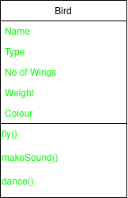
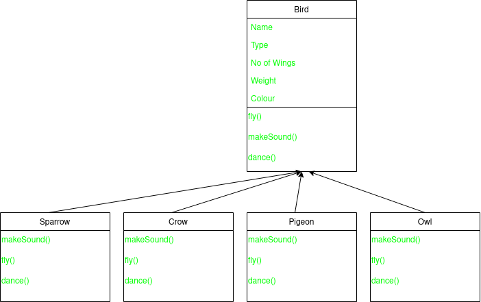
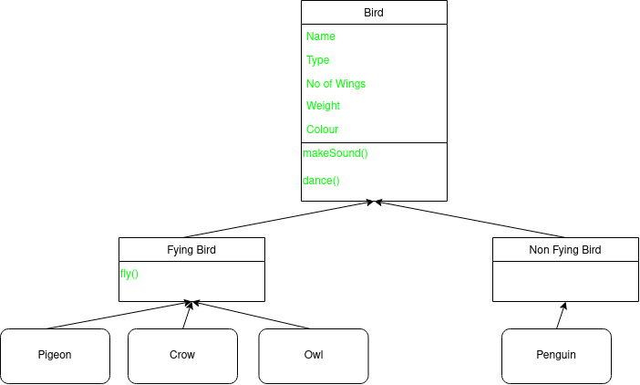

# Low Level Design

Low level design deals with details of the software required to implement various components of a web/system application. These software details include classes, attributes and methods in these classes, communication between classes etc.

The activities in a typical working day of a software engineer are the following

1. Meetings/Scrum - Requirements gathering, planning
2. Code Review - Readability is important here to effectively review code.
3. Solve Bugs/Debug - Code should be readable to identify bugs that come up during compile or runtime.
4. Documentation - For future readability. 
5. Testing - Ensure no/fewer bugs in the future.

## How does LLD help here? 

LLD helps you make all the tasks above easier. It helps to make the code readable/understandable. It helps you in requirements gathering. It also helps in making you system extensible and maintainable. 

Extensible: Easy to add new feature. It should not take a lot of time to incrementally add a new feature.

Maintainable: Easy to keep the current system in working condition. Why might a current system break or stop working? Bugs might show up in the system. Updates in OS or third party libraries being used. A maintainable system should make it easy to make the changes in order to keep the system running.

## Introduction to LLD

There are some common paradigms in programming.

1. Procedural programming - This is used by beginners
2. Object-oriented programming - The topic of our discussion
3. Functional programming
4. Reactive programming
5. Declarative programming (SQL)

### Procedural Programming

Procedure is a set of instructions to perform a task or achieve an outcome. This is the same definition as a function. A procedure is nothing but a function/method. We organize our code into a bunch of procedures. Each procedure may internally call other procedures. Execution of a program starts from a special procedure (called main()).

Procedure can be formally defined as a set of instructions that work on a given set of data and may output some data. 

### Cons of Procedural Programing

The basic structure of an english sentence is subject + verb. Subject perform action. Suppose, we want to print details of student. Using the procedural paradigm we might call a function like this
```
print(string name, int age, string gender){
    system.out(name);
    system.out(age);
    system.out(gender);
}
```
In the procedural paradigm, there is a way to combine a set of attributes using something called struct/structure. To create a struct
```
struct Student{
    String name;
    int age;
    String gender;
}
```
A struct has no methods. All the variables in a struct are visible to anyone else. They are not private.

Now we can rewrite the print function as
```
printStudent(Student student){
    system.out(student.name);
    system.out(student.age);
    system.out(student.gender);
}
```
In this case the subject can be considered to be the student and the action can be considered to be printStudent. In procedural paradigm, we see that something is happening to someone. Action is being performed on entity. In real life, entity performs action. In this case it is difference between printStudent(student) vs. student.print(). In the first case, the printStudent method is performing an action on student, whereas in the second, the student is performing the action print.

In procedural programming, everything about an entity is public. What is the problem with this? In the procedural world, there is a controller who makes entities perform actions. The controller has access to all information of entities. So controller can play around in any way with entity's attributes. If by any chance a controller changes the values of some of the entity's attributes, it would be difficult to debug.

Object-oriented programming says that a software system should consist of entities. Each entity controls its attributes and also has a defined behaviour. What would the entity student look like here?
```
class Student{
    String name;
    int age;
    String gender;

    void print(){
        system.out(name);
    }
}
```
As you can see, student is in control of its behaviour. 

To summarize, the cons of procedural programming are:

1. It will be difficult to make sense of a complex system. This is because any action that can be taken on entity will be at difference locations. In contrast, every action that student will perform will be in the class itself.

2. Understandability is difficult.
3. Difficult to debug.
4. Spaghetti code. This means parts of the code relating to an entity are lying in different parts of the filesystem.


### Object Oriented Programming

Principle: Abstraction

Pillars: Inheritance, Encapsulation, Polymorphism

#### What is Abstraction?

The quality of dealing with ideas and not events. It means representing an entity in terms of ideas. In the software world, anything that has attributes (information) or associated behaviour is an idea.

Taking the example of an education web app, we will need to represent students, instructors, classroom, batch, assignment, questions etc. Student has information and also associated behaviours. Student has information like name, university attended etc. Student also has behaviours like attending a class, sending messages, taking exam etc.

An idea can either be a real entity associated with a system or it can be a concept. When you represent something as an idea, others do not need to know the details of these ideas. Consider a car. When we think of a car as a driver, we think of steering wheel etc. Steering wheel has one behaviour that we care about as a driver. That it can turn.  We do not care about how this is achieved. 

Others do not need to know about the detail of implementation of ideas.

#### Encapsulation

Encapsulation is a pillar that helps us achieve abstraction. Encapsulation allows us to store attributes and behaviours of an idea together in a single place. What is this place? It is a class.

There is another benefit to encapsulation. It helps us protect the attributes and behaviours from illegitimate access of other classes. 

#### Terms of OOP

**Class** - Blueprint of an idea. Let's take the idea of a student that we saw earlier. Let's explore some of a student's attributes and ideas.

```
class Student{
    int age;
    String name;
    String batch;
    double psp;
    changeBatch();
    pauseCourse();
    giveMockInterview();
}
```

Class is not a real thing yet. It does not take any space in memory. It is a blueprint that we use to create multiple instances of this class. What are these instances called? Objects.

**Object** - Real instance of the class. Objects will occupy memory. Each object is different from each other. 

```
class Main {
    void main(){
        Student naman = new Student();
        naman.name = "Naman";
        naman.age = 25;
        naman.psp = 0.0;

        Student dinesh = new Student();
        dinesh.name = "Dinesh";
        dinesh.age = 20;
        dinesh.psp = 100.0;
    }
}
```
Two objects of class Student, naman and dinesh, have been instantiated. They occupy space in the memory and are distinct from each other.

**Access Modifiers** - We saw earlier that one of the benefits of encapsulation is that it protects the members from illegitimate access. How is this done? Using access modifiers. 

There are 4 access modifiers:

1. Public

If an attribute or a method has the access modifier public, then anyone outside the class can access thiis attribute or method.

2. Private

This is the exact opposite of access modifier public. It is only accessible within its own class. No one can access it, including the child class.

3. Protected

An attribute or method that has the access modifier protected can be accessed only from anything that is in the same package.

4. Default

```
            Class   |   Package     | Subclass/child | Subclass/child |   World
                                        (same pkg)        (diff pkg)

private       +     |      -        |       -        |        -       |     -

default       +     |      +        |       +        |        -       |     - 

protected     +     |      +        |       +        |        +       |     -

public        +     |      +        |       +        |        +       |     +

```


**Constructors** - To instantiate an object of a class we run the following
```
Student st = new Student();
```
Student is the datatype. st is the variable name. new Student() is the constructor. To be more specific, this is the default constructor. When we dont create our own constructor in the class, a default constructor is created. This creates a new object of the class and sets the value of each attribute as the default value of that type. 

The constructor code looks like this
```
Student(){
    name = null;
    age = 0;
    psp = 0.0;
    universityName = null;
}
```
This code is generated automatically in case the default constructor is called. 

The constructor looks similar to a method. Default constructor does not take any parameters. It sets every attribute of the class to the default value of the attribute's datatype unless we have already specified a default value. The constructor access modifier is public. The name of the constructor is the name of the class. There is no return type in the constructor. 

Suppose we write our own constructor
```
class Student{
    private int age;
    String name;
    String univName;
    double psp;
    boolean isPlaced;

    public Student(String studentName, String universityName) {
        name = studentName;
        univName = universityName;
    }
}
```
Let us now create a client class.
```
class Client {
    public static void main(String[] args){
        // Student st = new Student(); This will throw an error
        Student st = new Student(studentName: "Naman", universityName: "ABC");
    }
}
```
Let us run this and look at the values that the attributes of these objects take. When a custom constructor is called, all the values of the attributes are initialized to the default value of the corresponding datatype. Then it will start executing the code inside the constructor. The default constructor is not called or created. 

If we set the contructor's access modifier to private, then it is not possible to create an object of the class because neither can the constructor be called from outside the class, nor will a default constructor be created because of the presence of a parametrized constructor.

We can have multiple constructors in the class each parameterized by a different value.

Suppose we want to create a new object that takes the exact values as an older object.

```
class Student{
    private int age = 21;
    String name;
    String univName;
    double psp;
    boolean isPlaced;
    
    public Student(String studentName, String universityName) {
        name = studentName;
        univName = universityName;
    }

    public Student(Student old) {
        name = old.name;
        age = old.age;
        univName = old.univName;
        psp = old.psp;
        isPlaced = old.isPlaced;
    }
}
```
The client code will look like
```
class Client {
    public static void main(String[] args){
        Student st1 = new Student(studentName: "Naman", universityName: "LFG");
        st1.psp = 100.0;
        st1.isPlaced = false;

        Student st2 = new Student(st1);
    }
}
```
Instead of the above, if we run
```
Student st2 = st1;
```
st2 is not a new object as we did not call a constructor. st2 is just a variable pointing to st1.
So if we run
```
st2.name = "Aman"
```
then st1.name will also become Aman.

If we create st2 using the copy constructor, then st2 and st1 will occupy different memory address. 
So, if we run
```
st2.name = "Aman"
```
then st1.name will remain "Naman".

There are 2 types of data in Java.

1. Primitive Types - Integers, double, float etc. 

2. Objects - These are stored in memory. Variable stores the address of object. When we create
```
Student st = new Student();
```
it creates a new object in memory. st stores the address of the object. The name in st is also an object datatype as it is a string. So, java creates an object with value "Naman" in memory and the address to this object will be stored in st.name. In contract st.age will store the value itself in the memory occupied by the object.

In a copy constructor, we create a new object. st2 will be at a different memory location than st1. 


The above is a Java memory heap. We have two objects that are occupying addresses 1721 and 4741. The name attribute of each object is pointing to the string object at 2141. If we run
```
st2.name = "Hello"
```
Then an object with string "Hello" is created at 41. The name attribute of st2 now starts pointing to address 41. So, the name attribute of st1 will not change. 

Assume strings are mutable in Java, and assume we run the following code instead of the one above.
```
st2.name.add("123")
```
This will go to memory address 2141 and add "123" to "Kiran". This will not create a new object. Now, after making the change, the name attribute of st1 will also change from the previous "Kiran" to "Kiran123".

Even though we created a new object, behind the scenes, the new object still refers to a few attributes of the old object. This means the new and old object still share some data. This means both are not completely seperated. This means we performed a shallow copy. As opposed to shallow copy, deep copy means no attribute will have shared data. 

In Java, it is practically difficult to create a deep copy. Consider a student object that has a list of classes. Assume every class has a name and instructor. Lets look at the memory heap.


There are many pointers as all of the data in the memory are of the type object. Hence, to make a deep copy, we will have recursively make a copy of every object and create a new object. This practically very difficult.

```
doSomething(Student st) {
    st.name = "Naman";
}

st1 = new Student();
doSomething(st1);
```
When we run the above code, st1.name will become "Naman". As Java is pass by value, the value that is passed as argument is the address of the object that is stored in st1. So when wwe run st.name = "Naman", we go to the address and change the name attribute in the object. 

However, consider the following function.
```
doSomething(Student st) {
    st = new Student();
}
st1 = new Student();
doSomething(st1);
```
In this case, assigning a new object to st in the function doSomething does not change the object stored in st1. The variable st gets a new object without changing the value of st1. If Java supported pass-by-reference, then running the above code will change st1 to the same new object created and stored in st. This is because pass-by-reference is actually passing a reflection of the argument. Pass-by-value is passing the value of the argument to a new variable created in the parameter of the function.


**Destructor** - Once, work is done with an object, in languages like Java and Python, garbage collector removes these objects. In languages like C++, which are languages that use pointers, we have to use destructors to free up memory occupied by objects that are not in use anymore. 


#### Inheritance

Object oriented programming is based on thinking about software systems in the same way as we think about the real world. We form hierarchy/relations betweeen different entities inorder to understand them. In the same way, object oriented programming also allows us to form hierachies of categorization.


Consider the above categorization. If animals can walk, then does that mean a lab can walk? Yes. Lab is a dog is a mammal is an animal that can walk.

This kind of hierarchy of representation allows us to share behaviours and attributes with specific categories.

Representation of hierarchy in classes is known as inheritance. This takes the form of parent/child relationship between different classes.

Consider the example of scaler platform. A user of the platform can have a hierarchy. 


If a user can login(), then all the user's children can also login. Each child of user will share all the members (attributes and methods) of user class. A child class can have its own attributes and methods as well. Parent class can also be called a super class and a child class can also be called a subclass.

Child classes inherit all the members of the parent classes and may or may not add their own members to them.

```
class User {
    String username;
    void login() {
        system.out("Logging in...");
    }
}

class Instructor extends User {
    String batchName;
    double avgRating;
    void scheduleClass(){
        system.out("Scheduling class...");
    }
}
```

Parent class is a generalization. Child class is a specification.


Which of these classes has the highest level of abstraction? 

The answer is class A. Abstraction means an idea. Highest level of abstraction means a relatively generalized idea. The least specific class amongst all the classes is class A. 

When an object of the child class is instantiated, it also contains the attributes of the parent class. How are the attributes of the parent class initialized?

There are 2 options.

1. We know how to initialize them. So we can define them in the child class constructor.
```
class User {
    String name;
    String email;
    String password;

    void login() {
        system.out("Logging in...");
    }
}

class Instructor extends User{
    String batch;
    
    public void Instructor() {
        name = "a";
        email = "email@email.com";
        password = "password";
    }
}
```
We might not always know how to initialize the attributes of the parent class. An example would be if the parent class is from a third party library.

2. The constructor of the parent definitely knows how to initialize its attributes. 


Suppose we run
```
D d = new D();
```
a. The constructor of D will be called.
b. Before the constructor of D executes, it will call the constructor of C.
c. Before the constructor of C executes, it will call the constructor of B. 
d. Before the constructor of B executes, it will call the constructor of A.

So the execution of the constructor of A completes first, then the one of B completes, then the one of C completes and then the one of D completes.

This example assumes we are calling default constructors. If we want to call a specific constructor we have to use super().
```
class A {
    A() {
        System.out.println("Constructor of A");
    }
}

class B {
    B() {
        System.out.println("Constructor of B");
    }
}

class C {
    C() {
        System.out.println("Constructor of C");
    }

    C(String c){
        System.out.println("Constructor of C with param");
    }
}

class D {
    D() {
        super(c:"Hello");
        System.out.println("Constructor of D");
    }
}
```
The first line of the constructor of D should be super(c:"Hello"). If it is the second line, it will throw an error.
super() -> super can be thought of as the name of the class. So super() is calling the constructor of the class. So, if we dont pass argument in super(), then it calls the default constructor.

#### Polymorphism

If we go back to the Scaler example, the user takes multiple forms like student, instructor, mentor, TA etc. If we make a list of all users, then the list will take all objects of type User and of type any child class of User.

```
List<User> users = {
    new Student();
    new TA();
    new User();
    new Instructor;
}
```

Similarly, when creating a new object, we can run the following
```
User u = new Student();
```
However, we cannot do the following
```
Student st = new User();
```
This means we can put objects of child classes into a variable that takes the parent class datatype.

```
class A {
    int age;
    String name;
}

class B extends A {
    String univ;
}

class C extends A {
    String company;
}
```
Given the above, what happens when we run the following?
```
A a = new C();
a.company = "Google";
```
This will throw a compile time error. Compiler will allows access to members that are of that data type.

Polymorphism's use case is that it makes the code reusable. Consider the changePassword() function.
```
changePassword(User user, String newP) {
    user.password = newP;
}
```
Now, to this function we can pass objects of any of the child class of User. Polymorphism makes the code general. The more general your code, the better its reusablilty.

There are two types of polymorphism.
1. Compile Time poymorphism
2. Run Time polymorphism. 

Until now, we saw polymorphism in inheritance. There are 2 other places where polymorphism exists.

a. **Method Overloading**

Consider a class A
```
class A {
    void hello() {
        System.out.println("Hello World");
    }
    void hello(String Name) {
        System.out.println("Hello " + Name);
    }
}
```
When we call hello(), the first function will be called. When we call hello("Naman"), the second function will be called. 

The compiler knows the final form of the function that will execute. Hence, method overloading is compile time polymorphism.

```
void printHello() {}
void printHello(String S) {}
```
This is and example of method overloading.

```
void printHello(String S) {}
void printHello(Integer S) {}
```
This is an example of method overloading.

```
void printHello(String S) {}
String printHello(String S) {}
```
This is not method overloading. This is not even allowed. 

Lets dive deeper into method overloading. First let us understand method signature.

Method signature - NameofMethod(Data types of params). Consider the method
```
void printHello(String name, int age) {}
```
The signature of the above method is printHello(String, int).
```
String doSomething(int years, String time) {}
```
The signature of the above method is doSomething(int, String)

The return type of the function is not a part of method signature.

Methods are known to be overloaded when they have the same name but different signature. This is why the third example was not method overloading. Because they had the same name and the same signature. In the first two examples, the method names and the method signatures are the same.

```
int doSomething() {}
String doSomething(String s) {}
```
This is an example of method overloading, because the method name is the same and the method signature is different.

b. **Method Overriding**

Consider a class
```
class A {
    void doSomething(String a) {

    }
}

class B extends A {
    String doSomething(String c) {

    }
}
```
This will throw a compile time error as the method from class A is inherited by class B.

```
class A {
    void doSomething(String a) {
        System.out.println("Hello")
    }
}

class B extends A {
    void doSomething(String c) {
        System.out.println("Bye")

    }
}
```

If parent and child class have a method with the same signature and the same return type, this is called method overriding. The parent's method will get hidden.

Lets look at the client class
```
class Client {
    public static void main(String[] args){
        A a = new A();
        a.doSomething();//prints "Hello"
        a = new B();
        a.doSomething();prints "Bye"
    }
}
```
The method that is executed is of the data type that is present at execution and not the type of variable. Thus we do not know the exact output at compile time.


Consider the above set of classes. Class A has a method doSomething() that prints "hello". Class C has a method doSomething() tht prints "hi".

```
D d = new D();
d.doSomething();
```
When we run the above, "hi" is printed.

```
A a = new D();
a.doSomething();
```
When we run the above, again, "hi" is printed.

```
C c = new D();
c.doSomething();
```
When we run the above, again, "hi" is printed.

```
B b = new C();
b.doSomething();
```
When we run the above, again, "hi" is printed.

```
B b = new B();
b.doSomething();
```
When we run the above, "hello" is printed.

Compiler relies on datatype of variable, while runtime relies on actual object
Consider the following classes.

```
class A {
    void doSomething() {
        System.out.println("Hello");
    }
}

class B extends A {
    void doSomething() {
        System.out.println("Hi");
    }

    void do() {
        System.out.println("Yo!");
    }
}
```

```
A a = new B();
a.do();
```
If we run the above code, we will get a compile exception. As do() method is not present in class A. 
```
A a = new B();
a.doSomething();
```
This, as we have seen, will print "Hi". This will not throw a compile time exception because doSomething is present in class A as well.

Method overriding is an example of runtime polymorphism.


#### Interface

Consider a concept that is not a real entity (not really having any attribute or definition of methods). This concept is categorized by the type of behaviours it supports. For example, animals can be classified by their bahviour. We can say anyone that can eat, walk and run is an animal. We dont need to know how these behaviours work. We just need to know that entities that can exhibit these behaviours are called animals. 

We can implement this using something called interfaces. Interfaces define a set of behaviours that must be implemented by a class in order to be included in the category. 

```
interface Animal {
    void eat();
    void walk();
    void run();
}

class Cat implements Animal {
    void eat(){
        System.out.println("Cat is eating");
    }

    void walk(){
        System.out.println("Cat is waling");
    }

    void run(){
        System.out.println("Cat is running");
    }

    void meow(){
        System.out.println("Cat is meowing");
    }
}

class Dog implements Animal {
    void eat(){
        System.out.println("Dog is eating");
    }

    void walk(){
        System.out.println("Dog is waling");
    }

    void run(){
        System.out.println("Dog is running");
    }
}
```
This is how interfaces are implemented in Java. Any class that implements an interface can have its own methods apart from those methods declared in the interface. For example, in the class Cat, there is meow method which is exclusively a part of that class.

A principle in OOP is, always program to interface not an implementation. Informally, the same can be said as, we should not program to specific classes. Keeping our classes as general as possible is always the better choice.

Whenever there are multiple was to do something, create an interface with a method called doSomething(), which will then be implemented by other classes that implements the interface.

Benefits of interface is that systems become maintainable. When a class A has an attribute of class B, consider if we can make class B implement an interface. Instead of using class B, we can then use the interface, which generalizes the system.

One class can implement multiple interfaces.

#### Abstract Class

Consider an entity that has attributes and behaiours. However, we dont have clarity on how thee behaviours will work.

For example, consider Animal.
```
abstract Animal {
    String name;
    int age;

    abstract void walk();
    abstract int numberOfLegs(int count);
}
```
The benefit of this is that any child class of the abstract class is forced to implement these methods.

```
class Tiger extends Animal {
    int legsCount;
    void walk () {
        System.out.println("Tiger is walking");
    }
    int numberOfLegs(int count) {
        legsCount = count;
    }
}
```
If child class cannot implement all the methods of the abstract parent class, then the child class should also be called abstract class. We cannot create objects of abstract classes.

An abstract class with no attributes is called an interface.

Why is multiple inheritance not allowed? Due to something called the diamond problem.


Lets say we run the following code
```
D d = new D();
d.doSomething();
```
The doSomething() method comes from class B as well as class C. So, the compiler is confused. This is called the diamond problem and why some programming languages do not allow multiple inheritance. 
We can implement multiple interfaces because methods are only declared in an interface. They are not defined. So even if two interfaces have the same methods, as there is no method definition, the compiler will not be confusd. The same is not applicable in case of abstract classes, as abstract classes can have methods that are not abstract. Hence we would run into the diamond problem.

Use abstract classes when we have a parent class for whom we dont want to create an object.

#### Static

```
class Client {
    public static void main(String[] args) {

    }
}
```
A method is defined this way
```
[access-modifier][return-type][name](){}
```
When we call a method, we call the method on the object and not on the class. 

When we run the client file, we dont create an object of the client. So how is the method main() called?

Static keyword can be used with variables and method. A static method or variable allows us to access them without an object of the corresponding class. This is because static methods do not need objects of a class. They can access only static members. 

The most common use case of a static variable is to store a piece of information that is common for all objects of that class. For example, constants.

A static variable is created when we load a class which happens when an application runs.


#### SOLID Design Principles

S - Single Responsibility Principle
O - Open/close Principle
L - Liskov's Substitution Principle
I - Interface Segregation Principle
D - Dependency Inversion Principle

A software system should be extensible, maintainable, reusable, easily testable, modular, understandable. Using these principles will help us design a software system that fulfils these characteristics.

We are going to design a bird to learn the application of these principles. We are going to store information about birds. This information will include names, sounds, flying ability, types etc.



To create a bird
```
Bird b1 = new Bird();
b1.type = "sparrow";
b1.name = "chirp";

Bird b2 = new Bird();
b2.type = "crow";
b2.name = "cawmaker";

b1.fly()
b2.fly()
```
Do all birds fly or make sound in the same way? No.

The makeSound() method in the Bird class would be written like this
```
makeSound() {
    if type == "crow":
        System.out.println("Kaw Kaw");
    elif type == "sparrow":
        System.out.println("chirp chirp");
    elif type == "pigeon":
        System.out.println("gutur koo");
    else:
        System.out.println("None");
}
```

There are issues with the above structure.

1. Readability/Understandability: It is not easy to look at the code and understand where a bug may exist because of all the if-else statements.

2. Testing will become complex as we will have test each if condtion.

3. Merge Conflict: Difficult for multiple developers to work in parallel. Assume a developer is working on some birds and simultaneously another developer is trying to work on other birds and both try to merge their codes. There will be merge conflicts.

4. Code duplication: Suppose another client is only interested in a pigeon flying. The client will make a method just for this instead of using the Bird class. So the code related to pigeon flying is present in 2 places in the codebase. We should aim to never repeat ourselves.

5. It violated the single responsibility principle.


**Single Responsibility Principle**

Every code unit (method/class/package) in our codebase should have exactly 1 responsibility. There should be exactly one reason to change the code of that code unit.

In the bird class, makeSound() was responsible for how every bird will make sound. Similarly, fly() method was also responsible for how every bird will fly.

The bird class was responsible to hold attributes and methods of all the birds that exists.

One caveat when discussing single responsibility principle is to avoid over-engineering. There is a tradeoff between class/method explosion and single responsibility principle.

How do we identify violation of SRP?

a. Method with multiple if-else statements. Though this is not always true. If the if-else statement is part of the business logic, then it is not a violation of SRP. If the code inside each if-else block is independent of each other, then it is probably a violation of SRP.

b. Monster method: It has code that does lot more than what its name suggests. Consider the following example
```
saveToDatabase(User user) {
    String q = "Insert into users * VALUES(?, ?);

    Database db = new Database();
    db.set_url = ();
    db.make_connection();

    db.execute(q, user);
}
```
There a three responsibilities. 1. There is a query. Tomorrow, if the query has to be changed, we have to change it here. 2. We have to create a connection to the database. 3. We have to save the data in the table.

Lets change the method to the following
```
saveToDatabase(User user) {
    String q = CreateQueryToSaveUser();
    Database db = getDBConnection();
    db.execute(q, user);
}
```

SRP is identified when there is code duplication.

c. Commons/Utilities: This package usually end up becoming a garbage place of all the code that the engineer does not know where to put.

**Open/Close Principle**

Our code base should be open for extension, but closed for modification. It should be easy to add new features. However, adding new features should not require changing already written code.

Going back to our bird example, assume we have sparrow, crow, pigeon and owl. New requirement is, we need to add peacock. What changes do we need to make in the bird class?

We need to modify the fly() method, the makeSound() method to include another if-else block for peacock. Hence we need to modify the methods. This is a violation of the open/close principle.

Why do we need open/close principle. 

a. To make testing easier. 
b. Regression - Introduced new bugs while modifying the method. With o/c principle we avoid this.

We are going to rewrite the bird class to satisfy SRP and o/c principle.

Let the bird class be only responsible for generic details and not specifics. So we make it an abstract class with all the previous attributes and method. However, we define these functions in the specific classes. 



To add a new bird, we just have to create a new child class. We have reduced the number of potential changes we would have to make to the bird class in case of feature addition/modification. Bird class has lesser reasons to change. We still need a bird class, if say, we need a list of birds. Getting the list of birds will be hard without a bird class. 

Now, suppose we need to add a new bird penguin. Penguins cannot fly, however the penguin child class will have to implement the fly method in the Bird class. How do we resolve this situation?

Let us look at a few options:

1. One way around this is to leave the fly() method implementation in the Penguin class empty.

2. Throw an exception which says "Penguins cannot fly" when the fly() method is called. 

Let us say, we as a client have following code.
```
class Client {
    Bird b = getBird();
    b.fly();
}
```
In case b takes the object of the penguin class, then b.fly() will throw an exception. We, expecting the bird to fly, will get an exception. Our first reaction will be to search our own code for bugs, when the actual issue is at the library end. If the fly() method returns a "Penguins cannot fly", then that too is possibly a surprise for us if we expect the fly method to return the bird flying.

The principle here is that we should design our system so that our clients experiences the least possible amount of surprises.

Ideal Solution: If an entity does not support a behaviour, it should not have a method to do the behaviour.

A possible solution is to remove the fly method from the Bird abstract class and have two more abstract classes, one for flying birds and other for non-flying birds.



